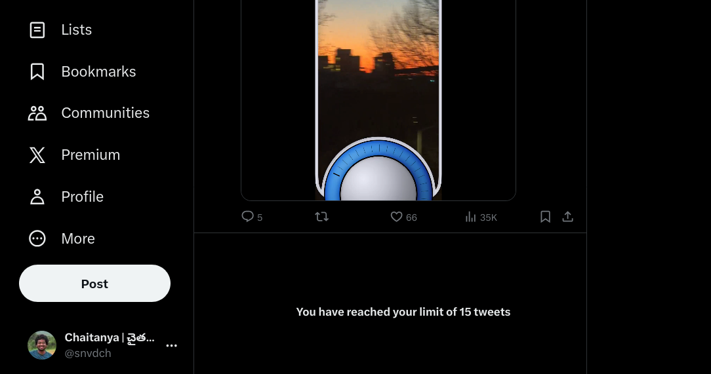
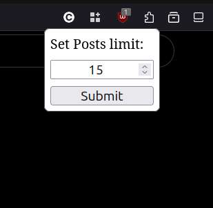

Firefox browser extension to limit the number of posts on the feed to a specified limit on X dot com.

This extension disables infinite scroll in X (Twitter) web application, instead limits the number of posts to a specified limit.

By default, the extension limits the number of posts to 20. You can change this limit by clicking the extension icon in the tool bar.

